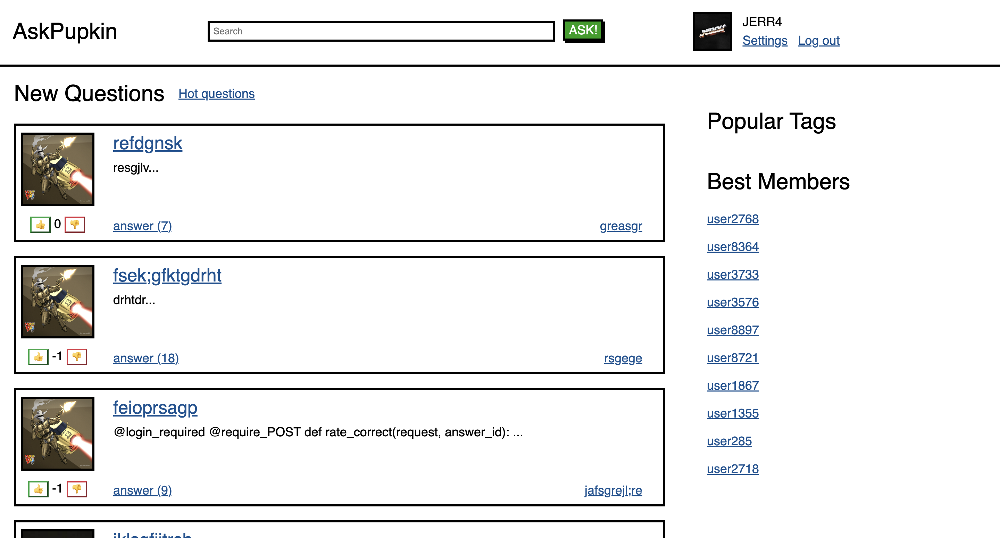
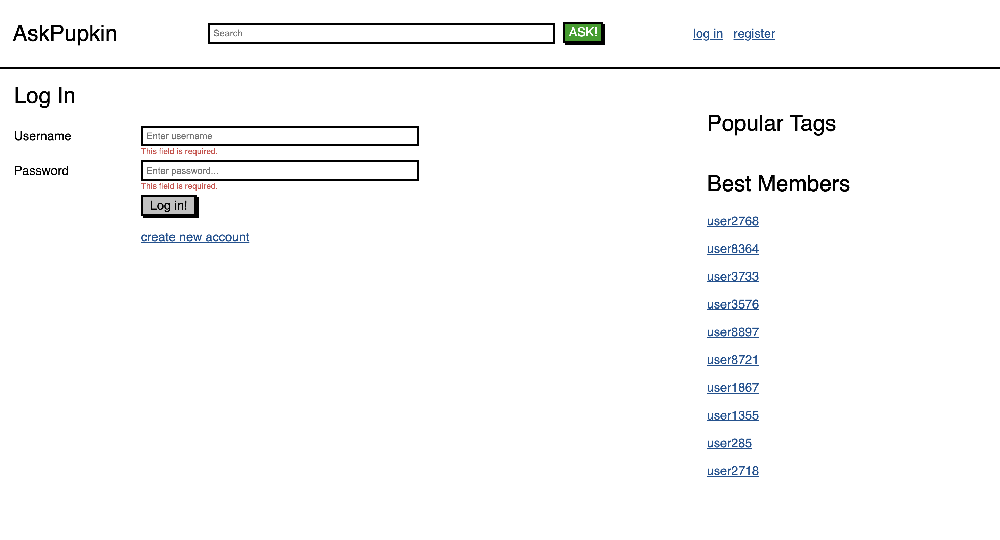
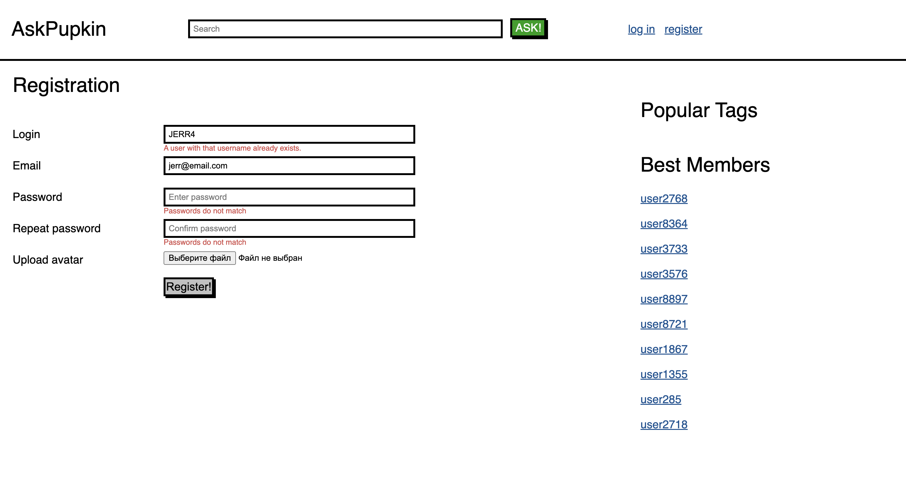
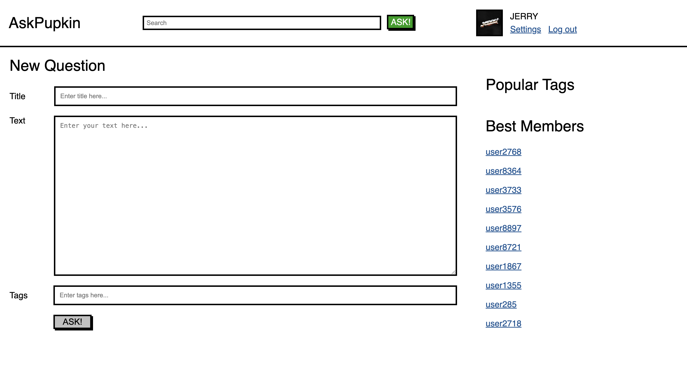
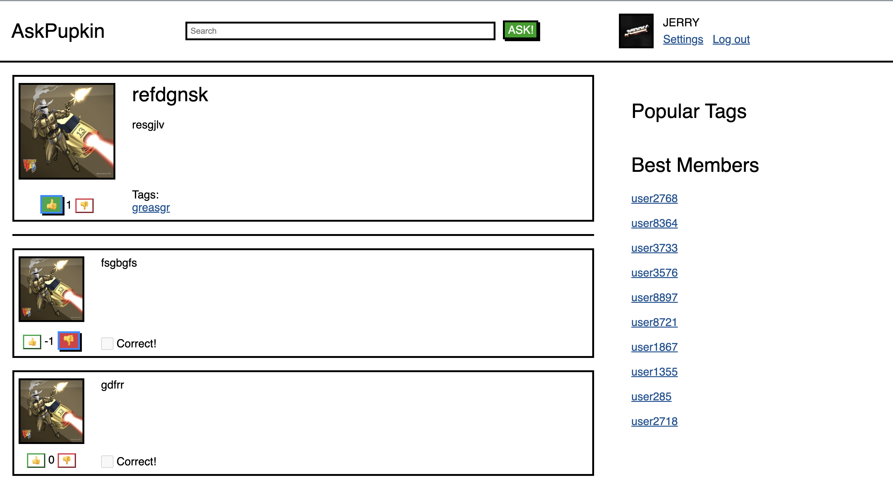

## Введение

Сайт вопросов и ответов, созданный с помощью фреймворка Django. В качестве application-сервера используется Gunicorn, а в качестве web-сервера - Nginx. Хранилище данных на PostgreSQL включает в себя более 100 000 вопросов и более 1 000 000 ответов.

## Содержание

1. [Главная страница](#главная-страница)
2. [Страница авторизации и регистрации](#страница-авторизации-и-регистрации)
3. [Профиль](#профиль)
4. [Страница одного вопроса](#страница-одного-вопроса)
5. [Новый вопрос](#новый-вопрос)
6. [Страница участника форума](#страница-участника-форума)
7. [Система лайков](#система-лайков)

### Главная страница

На главной странице можно увидеть вопросы, заданные пользователями со всего мира. Справа можно перейти на вопросы по более популярным тегам и увидеть наиболее активных участников сайта.

### Страница авторизации и регистрации

На странице авторизации необходимо ввести логин и пароль для входа в учетную запись. На странице регистрации нужно ввести необходимые данные о себе, придумать надежный пароль и (опционально) выбрать аватарку.

**Авторизация:**

**Регистрация:**

### Профиль

Здесь пользователь сайта может изменить информацию о себе, а также выйти из аккаунта.

### Страница одного вопроса

Здесь пользователь может ознакомиться с содержанием вопроса и прочитать ответы других участников. Также пользователь может оставить свои комментарии под постом.

.png)
.png)
.png)

### Новый вопрос

Авторизованный пользователь может задать свой собственный вопрос и оставить под ним соответствующие теги для того, чтобы вопрос попал в нужную категорию.

### Система лайков

С помощью технологии AJAX на сайте выстроена система лайков и дизлайков. Вы можете лайкать понравившиеся вопросы и ответы, поднимая их в топы.

